# Rendu de AVEKOR Honoré

Une capture par étape, dans l'ordre. Terminal entier non rogné, invite visible.
Afficher l'historique en graphe quand c'est pertinent.

## Niveau 1
1. Configuration Git
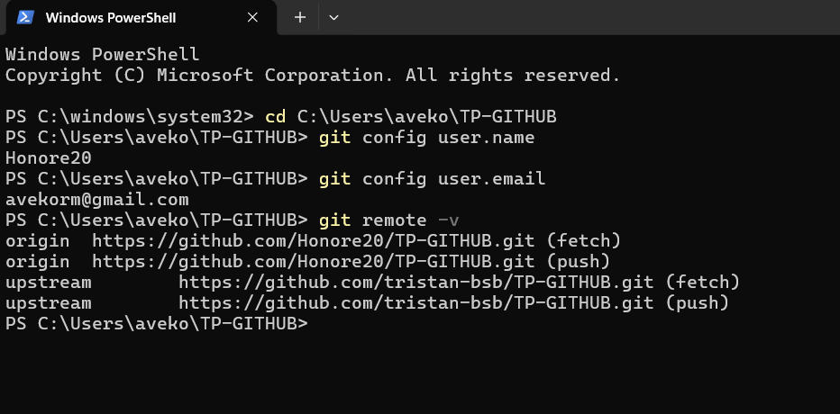
2. Branche de travail
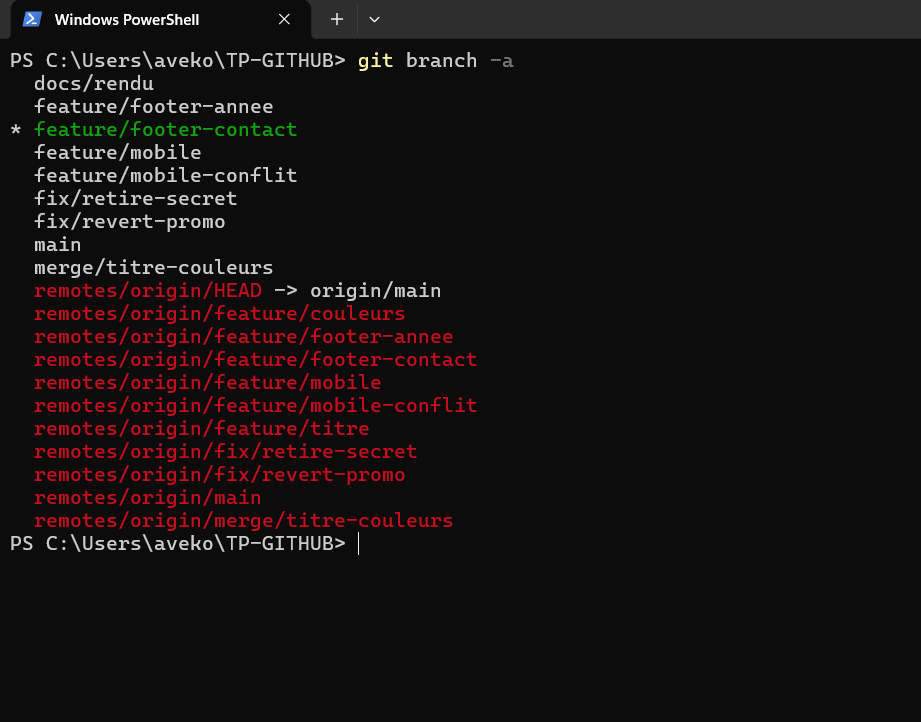
3. Historique des commits
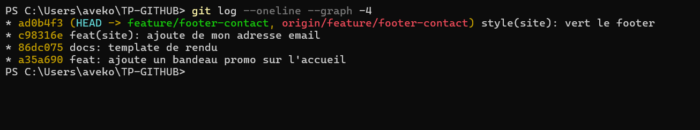
4. Pull Request
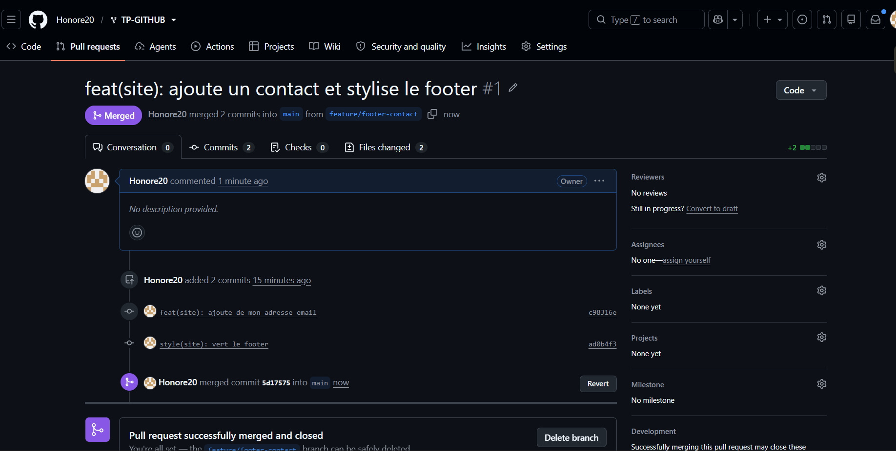
5. Revue croisée
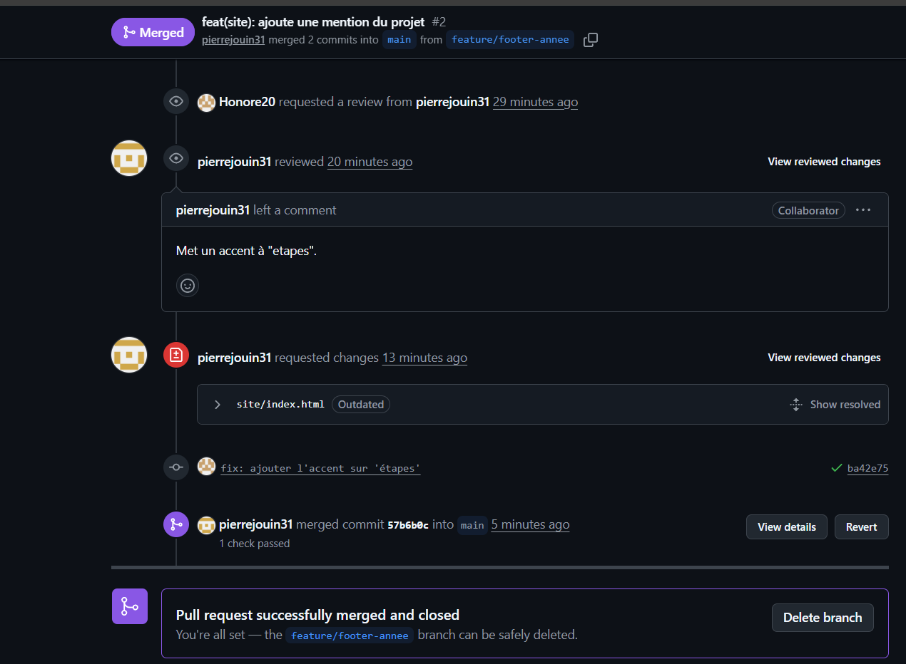

## Niveau 2
6. Secret retiré du suivi
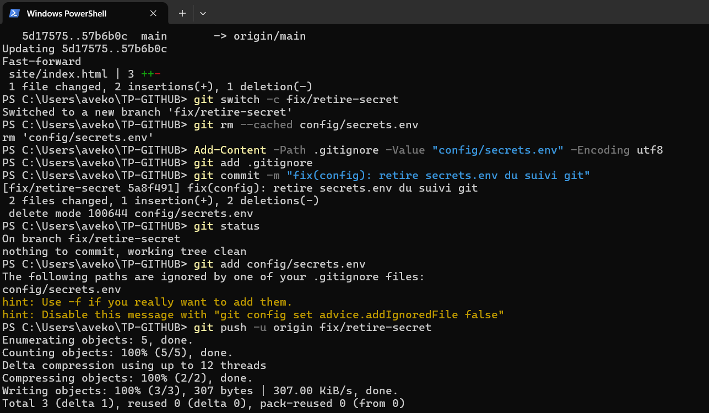
7. Conflit résolu (marqueurs avant, graphe après)
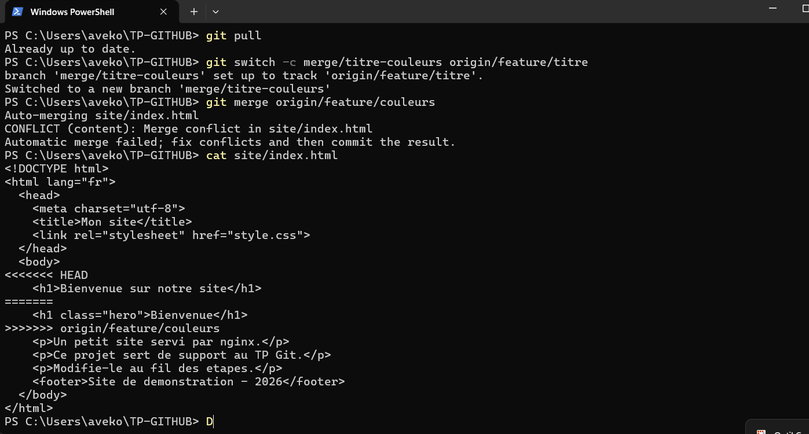
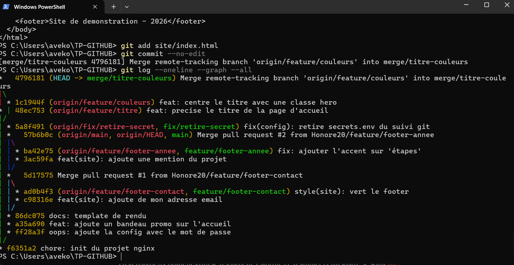
8. Revert du bandeau promo
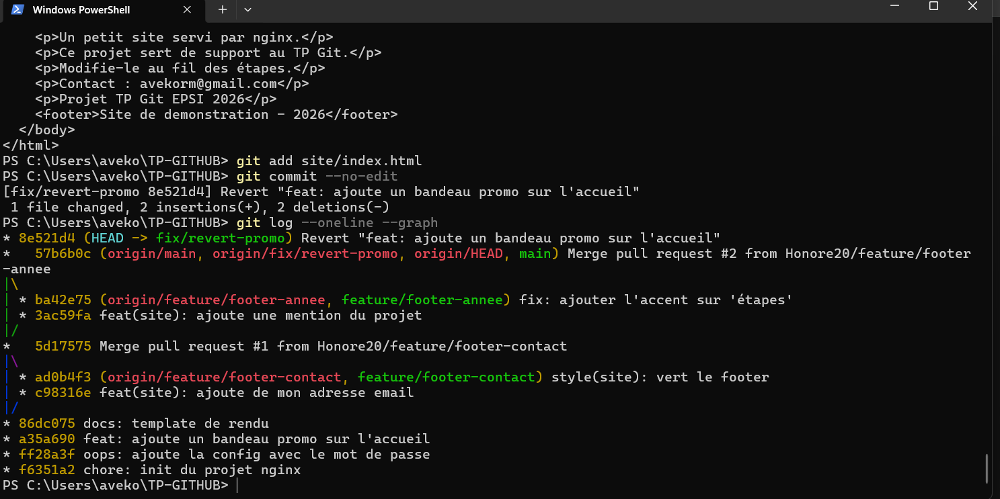
9. Issue fermée par une Pull Request
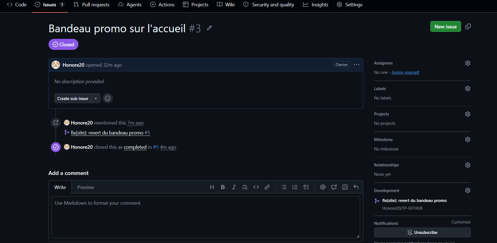
10. Protection de main et CI au vert
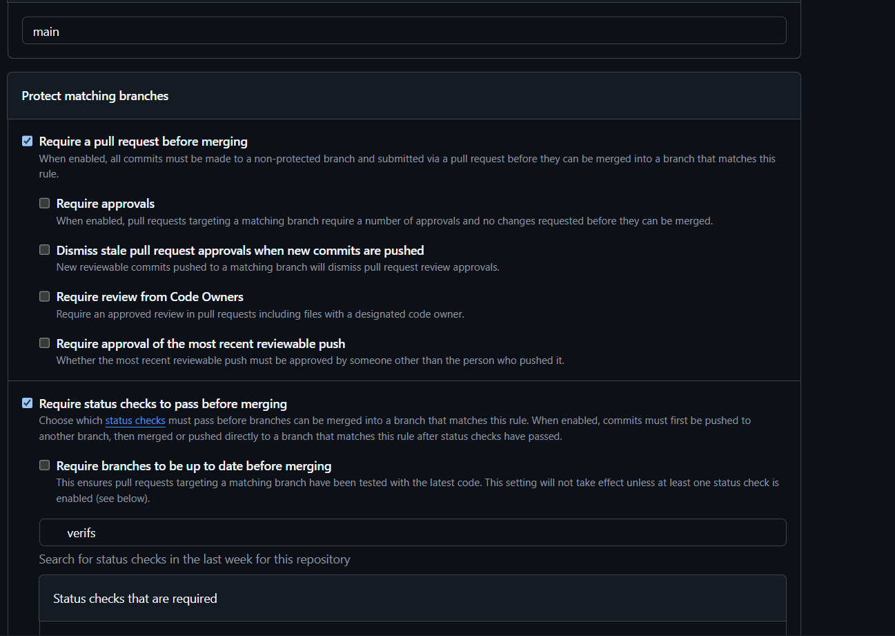
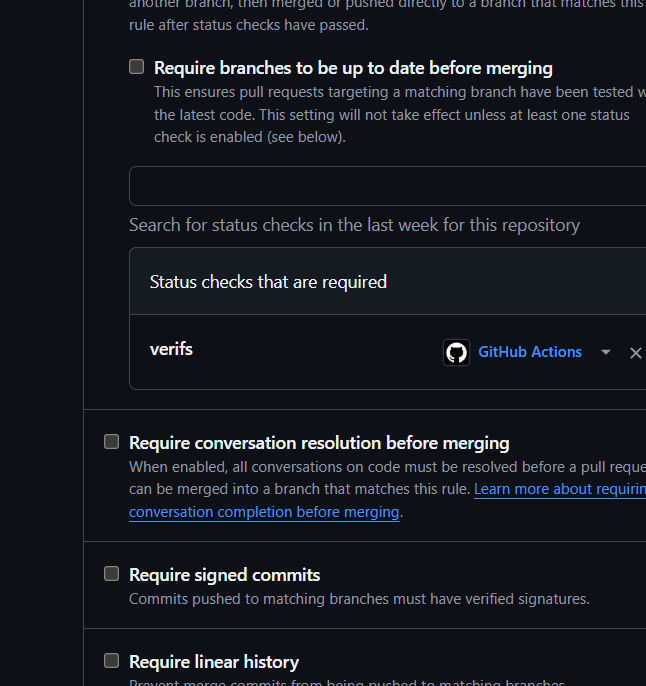
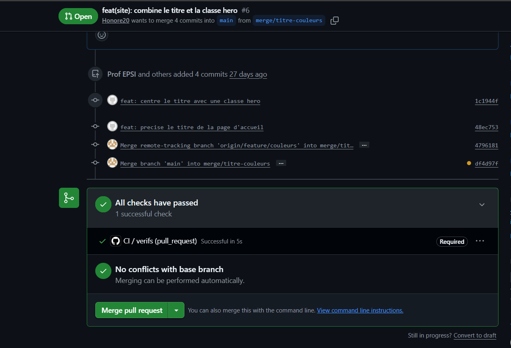

## Cible mobile
11. Commit distant récupéré et conflit résolu
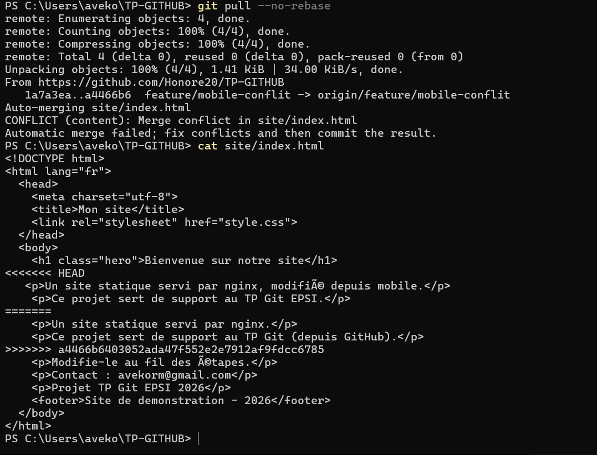
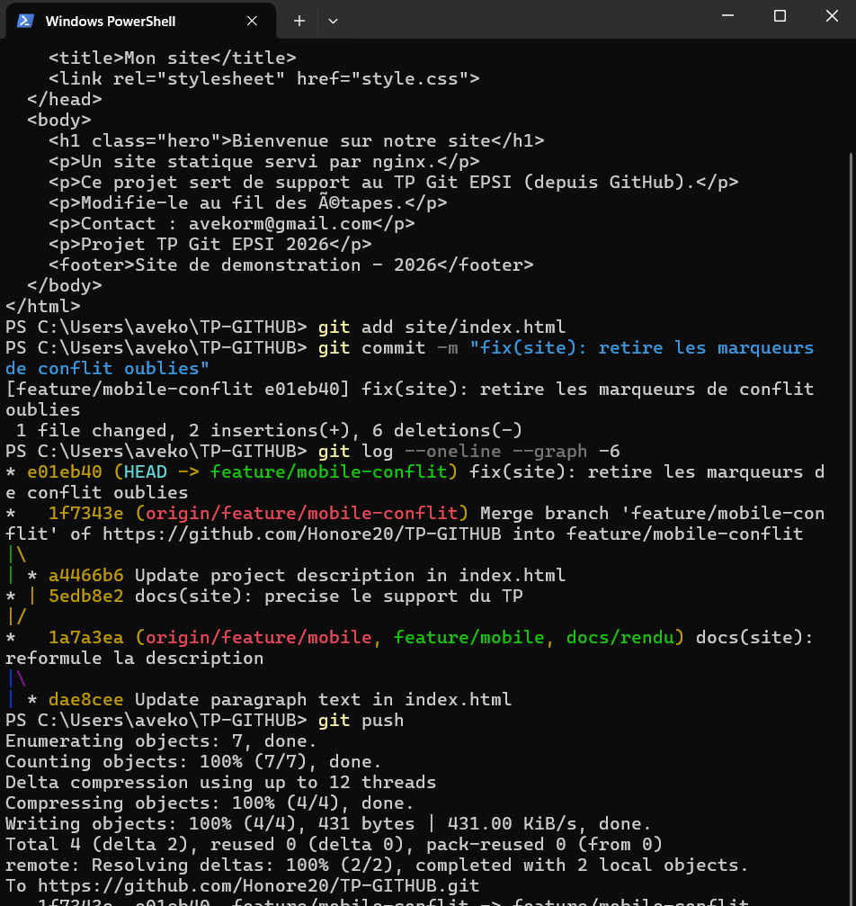

## Trois commits annotés
1. `5a8f491` : retire config/secrets.env du suivi avec git rm --cached et l'ajoute au .gitignore. Le fichier reste en local mais ne peut plus être commité. Le mot de passe reste lisible dans l'historique (ff28a3f), il doit donc être considéré comme compromis et changé.
2. `4796181` : merge de feature/couleurs dans feature/titre. Les deux branches modifiaient la même ligne h1 ; la résolution garde le texte de l'une et la classe hero de l'autre.
3. `8e521d4` : git revert du commit a35a690 (bandeau promo). Le revert crée un nouveau commit qui annule l'ancien sans réécrire l'historique, contrairement à reset, ce qui est indispensable sur une branche main protégée et partagée.